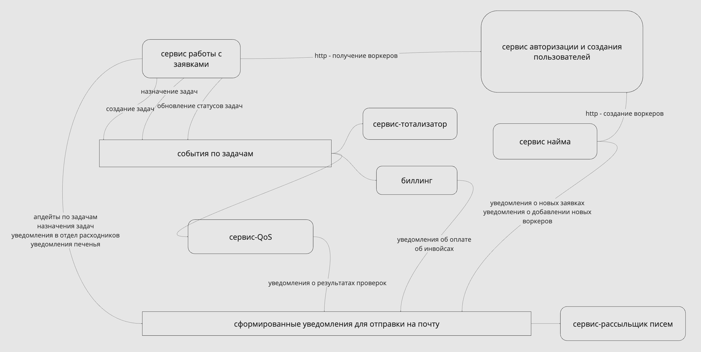

## Схема сервисов системы

### Описание системы

Микросервисы (или монолит+сервисы), потому что есть явные куски, которые можно вынести и поставить отдельно - часть из них живет сама по себе (тотализатор), часть выполняет функции общего флоу (рассыльщик писем).
Часть можно объединить в монолите, чтобы было быстрее (но я не умею в монолиты и у меня в голове все неплохо делится на сервисы).

- Тотализатор стоит совсем в стороне и завязан на события из основной системы - его можно выделить в отдельный сервис, подписать на события по задачам, которые будет генерировать флоу работы с задачами, и забыть про него (ибо он не будет особо меняться и сторонняя штука)
- Сервис биллинга - апи для начисления денег, кронджобы, запускающиеся в конце дня/месяца, собирают данные по базе заказов, формируют инвойсы, списывают деньги и формируют уведомления для воркеров и клиентов
- Рассыльщик писем - отдельный сервис, который реализует контракт взаимодействия с smtp-сервером, остальные сервисы отправляют ему данные для письма (отправитель, получатель, тело) через кафку (апи? зачем апи если можно кафку - письмо будет внутри и не потеряется, пока его не вычитают)
- Сервис найма - создание вакансий, получение заявок на вакансии, назначение тестов, сохранение воркеров
- Сервис работы с задачами - создание задач, назначение воркеров, расчет стоимости, отправка уведомлений, смена статусов
- Сервис авторизации - логин, определение роли юзера + апи для создания воркеров и клиентов
- Сервис QoS - сервис, слушающий события апдейта задач и принимающий формы рассмотрения качества выполнения

#### Почему такие коммуникации
* Для задач кафка и события - потому что смена статуса нужна большому количеству логических модулей, так они могут подписаться
* Для писем кафка - потому что много сервисов пишут, плюс нужно не потерять порядок уведомлений (можно все по одному юзеру класть в одну партицию) + в кафке оно не потеряется, пока сервис-рассыльщик не вычитает, даже если накопится лаг
* Для создания воркеров и клиентов - апи, потому что это единичные запросы и тут один отправитель и один получатель, плюс хотелось бы создать воркера синхронно, чтоб менеджер увидел, что воркер успешно создался

### Спорные места
- возможно окажется, что данные юзера понадобятся много где и придется дергать сервис авторизации и юзеров (но если класть достаточно инфы в события, должно быть норм)
- где рассчитывать стоимость заказа
- в какой момент начислять скидку - после выставления инвойса или после создания задачи, которая перешла границу? если оплата не пройдет, то будет некорректно применять скидку раньше времени

### Что вообще делала, чтобы прийти к решению

Ссылка на [миро](https://miro.com/app/board/uXjVK9DOSX8=/?share_link_id=627269931578)
1. Перенесла требования в список юзкейсов и разбила на группы по акторам, совершающим действия
2. Собрала цепочки действий, происходящих в системе
3. Собрала цепочки в логические кучки (с точки зрения продукта):
    * Флоу найма
        * создание вакансий
        * получение заявок менеджерами
        * назначение тестов
        * сохранение новых воркеров в системе
        * и тд
    * Флоу работы с заявками (основная работа системы)
        * создание заявок
        * назначение воркеров на заявки
        * расчет стоимости заявок
        * отправка уведомлений клиенту, воркеру, отделу расходников и поставщику печенья
        * смена статусов заявок
        * и тд
    * Флоу биллинга
        * выставление инвойсов
        * списание/начисление денег
        * история списаний и начислений
        * начисление денег воркерам от менеджеров
    * Флоу тотализатора
        * создание заявок
        * расчет результатов при обновлении статусов заявок
    * Флоу авторизации (этот флоу добавлен чисто логически - все должны как-то заходить в систему)
        * логин
        * определение роли юзера