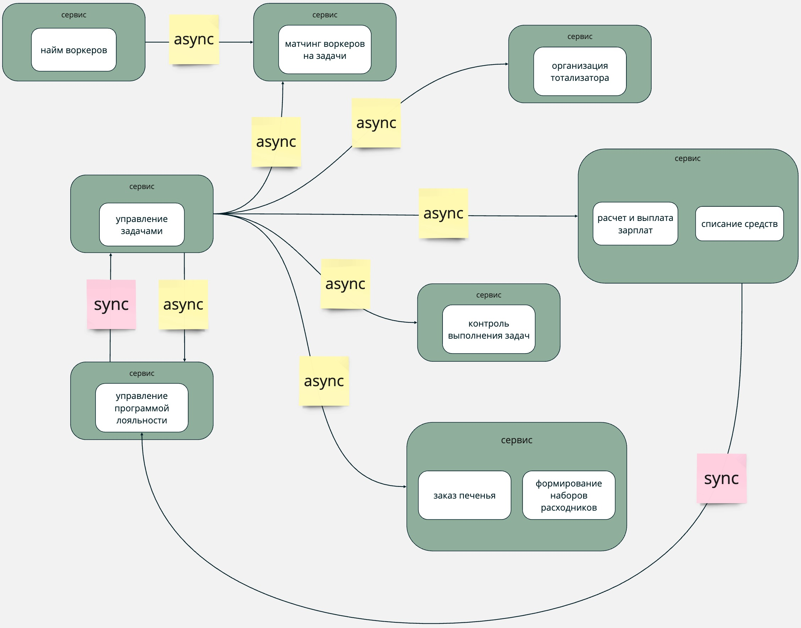

В [миро](https://miro.com/app/board/uXjVK9DOSX8=/?share_link_id=627269931578) домашка сделана со всеми комментариями и там проставлены заголовки - можно легко читать там, а можно здесь (тут продублирован тот же текст)

### Определение поддоменов и domain chart
- найм воркеров
- работа с задачами
- матчинг воркеров на задачи
- удержание клиентов
- поддержание мотивации менеджеров
- формирование комплектов расходников

Очень долго думала, является ли матчинг отдельным поддоменом - с одной стороны, это явно часть "работы над задачами", с другой стороны - бизнес очень явно цепляется за матчинг как за нечто особенное и он является основным преимуществом продукта

Решила вынести отдельно, потому что в теории "работа над задачами" может сущестовать и без "матчинга" - "матчинг" тут как отдельная подсистема.

### Определение bounded context'ов

#### Сравнение контекстов из первого и второго урока и пояснение решения
В варианте через DDD получилось больше контекстов (9 против 4-5)

Полностью сошлось как отдельные контексты:
- найм воркеров
- тотализатор

В ES из первого урока хотелось вынести "контроль качества выполнения задач" в отдельный контекст, но были сомнения, во втором уроке он явно стал отдельным контекстом в рамках отдельного поддомена.

В первом уроке биллинг выносился как отдельный контекст - сейчас он разбился на два bounded контекста внутри поддомена "работа с задачами". Думаю, он стал частью поддомена задач из-за того, что бизнесово является частью процесса работы над задачами, а не самостоятельным бизнес-куском. А разбился на два, потому что:
- у клиентов есть скидки и их расчет, у воркеров есть возможность получать дополнительные начисления от менеджеров - не связанные элементы логики
- логика выставления инвойса немного отличается в случае с клиентами и воркерами (в первом случае только успешные выплаты и инвойс после выплаты, во втором - все инвойсы и перед списанием)
- хочется перестраховаться на случай, если различий станет еще больше, и не делать общую логику в одном месте

Матчинг тоже был частью работы над задачами, а сейчас стал отдельным поддоменом (*тут на самом деле есть сомнения - должен ли он быть отдельным поддоменом*). Решила все-таки вынести отдельно, потому что матчинг - это важная часть бизнеса, которая должна быть основным преимуществом продукта - будет меняться, дорабатываться отдельно, на него нужно особое внимание; также в рамках контекста матчинга используется "внутренняя" терминология (но это конечно больше про то, что оно контекст, а не поддомен).

В первом уроке "заказ печенья" и "организация расходников" были частью "работы над задачами", а теперь "расходники" - это отдельный поддомент логистики, а "заказ печенья" выделены в отдельные контексты в поддомене "удержание клиентов". Думаю, так получилось, потому что в первом уроке они выглядели мелкими кусками с точки зрения нашей системы (по сути просто по одному бизнес-событию туда и обратно), но если смотреть на систему со стороны бизнеса, то заказ каких-либо расходников у сторонних участников (склад/поставщик печенья) - эти штуки наделены отличающимся бизнесовым смыслом.

Также перенесла расчет скидки в поддомен "удержания клиентов" - оно больше относится к бизнесу, чем к техническому расчету денег и выставлению инвойсов. Из-за этого поменяла логику работы со скидками - теперь скидка начисляется по сумме созданных задач, а не оплаченных инвойсов (иначе появляются дополнительные связи из биллинга в систему лояльности, но хочется, чтобы все изменения клиента триггерились без дополнительных проверок и событий из системы биллинга, а только на осонове событий из контекста работы с задачами)

На основе доменов, полученных во второй домашке, изменила es схему и модель данных, обновленная связь контекстов:

### Характеристики системы

Список кусков из требований, которые позволяют сформировать нефункциональные требования:
- благодаря отсеву и матчингу компания планирует выделяться на фоне конкурентов
- проект с нуля по заданным требованиям
- деньги на данный момент не критичны, happy cat box готовы потратить столько, сколько потребуется
- команда разработки будет собрана после нашего анализа требуемой системы
- необходим низкий ТТМ (Time To Market), чтобы конкурировать на рынке
- критично проверять новые гипотезы по отсеву котов и изменять уже существующие с максимальной скоростью и надёжностью
- система ставок не будет меняться и не критична
- возможен ддос заявками на вакансии
- общая нагрузка на систему не будет превышать 10 заказов в день и 100 клиентов, воркеров будет около 20 котов

Выделила следующие характеристики:
- *securability* - в системе есть базовая система ролей (клиент, менеджер, воркер, рандомный кот)
- *modifiability* - необходимо иметь возможность быстро изменять core-домены для проверки бизнесовых гипотез
- *maintainability* - большая вероятность ддос-атак, нужно, чтобы система быстро восстанавливалась, если что-то упадет из-за нагрузки
- *deployability* - важен TTM новых гипотез, важно, чтобы время деплоя было предсказуемым

### Выбор архитектурного стиля
Выбрала для системы смесь из service-based и microservices architecture.

Все сервисы используют одну базу данных, но разные контексты. Каждый сервис работает изолированно со своей схемой/таблицей - одна и та же таблица (таблица=сущность) не может быть изменена из разных сервисов, чтобы не было неявных изменений одних и тех же данных.

"**Тотализатор**" - отдельный микросервис со своей базой данных, в которой хранятся ставки (ид менеджера, ид задачи, условие). Связан с остальной системой через получение событий из контекста "**управление задачами**", ид менеджера может получать из токенов авторизации.

"**Найм воркеров**" - отдельный сервис, управляет информацией о вакансиях, кандидатах, тестах. Связан с сервисом "**матчинга**" - порождает события, триггерящие создание новых воркеров в сервисе "**матчинга**". Логика работы и отсева котов может часто меняться. Возможен ддос, не потянет за собой остальные части системы, если упадет.

"**Управление программой лояльности**" - отдельный сервис, управляет информацией о клиентах и их скидках. Связан с "**управлением задачами**" - реагирует на события создания новой задачи и перерасчитывает скидку клиента.

"**Матчинг воркеров на задачи**" - отдельный сервис, отвечающий за управление воркерами и назначением их на задачи. Новые воркеры появляются очень редко - не будут перегружать процесс матчинга. Связан с "**управлением задачами**" - реагирует на события создания новой задачи и реализует для нее матчинг. Алгоритм внутри этого сервиса может часто меняться.

"**Управление задачами**" - отдельный сервис, реализующий взаимодействие клиентов и воркеров с задачами. Порождает события создания задачи, изменения ее статуса. Синхронно связан с "**управлением программой лояльности**" - необходимо получать информацию о скидке клиента для отображения стоимости задач.

"**Интеграция с поставщиками**" - сервис, включающий в себя контексты "**формирование расходников**" и "**заказ печенья**". Технически в данный момент эти контексты представляют собой простую интеграцию уведомления внешних систем о создании нового заказа. Связан с "**управлением задачами**" - реагирует на события создания новой задачи и уведомляет поставщиков.

"**Биллинг**" - мини-layered-монолит - сервис, включающий в себя контексты "**списание средств**" и "**расчет и выплата зарплат**". Хранит информацию о списаниях и начислениях в формате транзакций (кому, сколько, за что). Куски для клиентов и воркеров должны быть логически разделены, потому что это разные бизнес-процессы -> для уменьшения связности и простоты потенциального модифицирования. Связан с "**управлением задачами**" - реагирует на события создания новой задачи и  изменения статусов задачи. Синхронно связан с "**управлением программой лояльности**" - при выставлении счетов и отправке инвойсов нужна биллинг информация о клиенте + почта/телефон/etc.

"**Контроль качества выполнения задач**" - с одной стороны, простой с технической точки зрения процесс, можно было бы сделать его частью в сервисе "**управления задачами**". С другой стороны, это породит синхронную связность внутри сервиса -> вынесу в отдельный сервис, поскольку для связности с ним не нужны новые элементы в системе - он будет использовать уже выделенные потоки событий с изменением статусов задач из "**управления задачами**".

