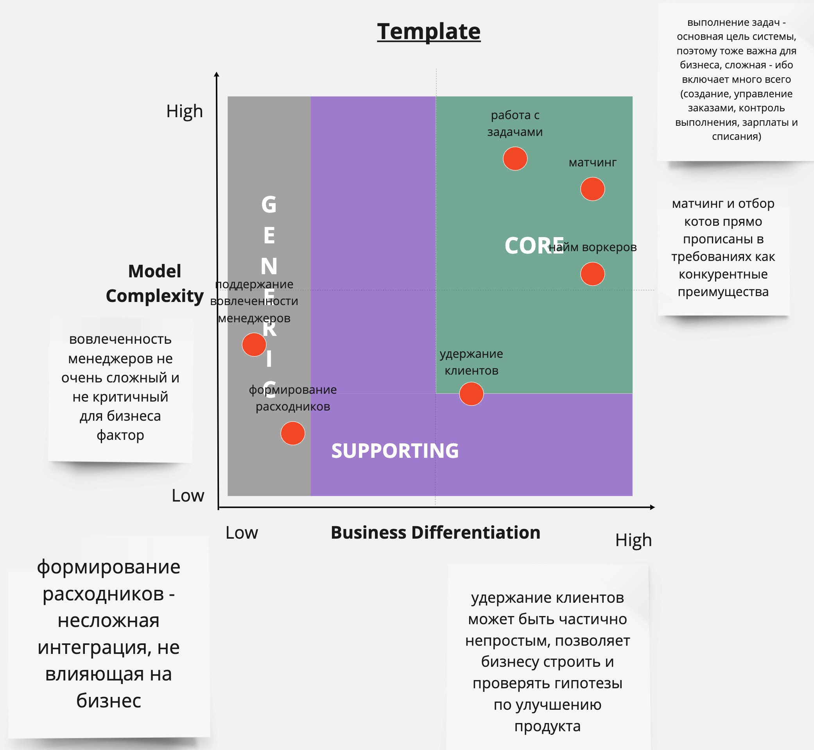
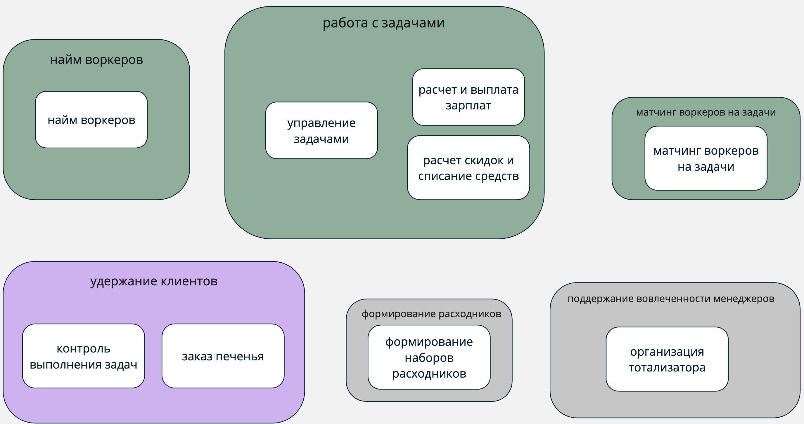
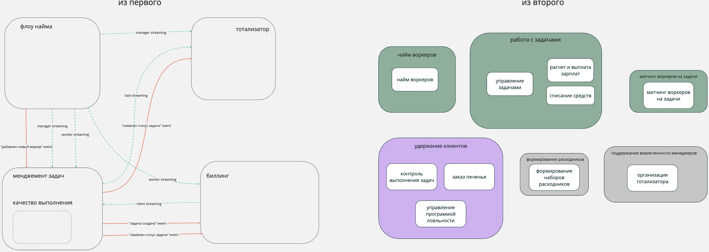
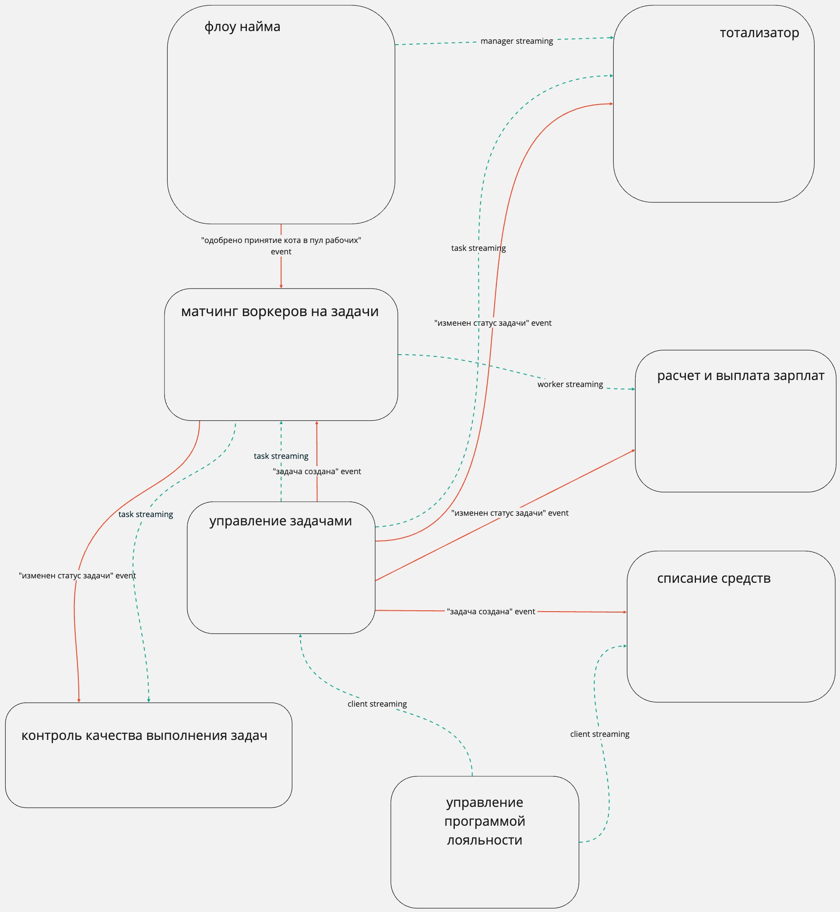

## Определение бизнес доменов

В [миро](https://miro.com/app/board/uXjVK9DOSX8=/?share_link_id=627269931578) домашка сделана со всеми комментариями и там проставлены заголовки - можно легко читать там, а можно здесь (тут продублировала тот же текст и комментарии)

### Определение поддоменов и domain chart
- найм воркеров
- работа с задачами
- матчинг воркеров на задачи
- удержание клиентов
- поддержание мотивации менеджеров
- формирование комплектов расходников

Очень долго думала, является ли матчинг отдельным поддоменом - с одной стороны, это явно часть "работы над задачами", с другой стороны - бизнес очень явно цепляется за матчинг как за нечто особенное и он является основным преимуществом продукта

Решила вынести отдельно, потому что в теории "работа над задачами" может сущестовать и без "матчинга" - "матчинг" тут как отдельная подсистема.

### Определение bounded context'ов

#### Сравнение контекстов из первого и второго урока и пояснение решения
В варианте через DDD получилось больше контекстов (9 против 4-5)

Полностью сошлось как отдельные контексты:
- найм воркеров
- тотализатор

В ES из первого урока хотелось вынести "контроль качества выполнения задач" в отдельный контекст, но были сомнения, во втором уроке он явно стал отдельным контекстом в рамках отдельного поддомена.

В первом уроке биллинг выносился как отдельный контекст - сейчас он разбился на два bounded контекста внутри поддомена "работа с задачами". Думаю, он стал частью поддомена задач из-за того, что бизнесово является частью процесса работы над задачами, а не самостоятельным бизнес-куском. А разбился на два, потому что:
- у клиентов есть скидки и их расчет, у воркеров есть возможность получать дополнительные начисления от менеджеров - не связанные элементы логики
- логика выставления инвойса немного отличается в случае с клиентами и воркерами (в первом случае только успешные выплаты и инвойс после выплаты, во втором - все инвойсы и перед списанием)
- хочется перестраховаться на случай, если различий станет еще больше, и не делать общую логику в одном месте

Матчинг тоже был частью работы над задачами, а сейчас стал отдельным поддоменом (*тут на самом деле есть сомнения - должен ли он быть отдельным поддоменом*). Решила все-таки вынести отдельно, потому что матчинг - это важная часть бизнеса, которая должна быть основным преимуществом продукта - будет меняться, дорабатываться отдельно, на него нужно особое внимание; также в рамках контекста матчинга используется "внутренняя" терминология (но это конечно больше про то, что оно контекст, а не поддомен).

В первом уроке "заказ печенья" и "организация расходников" были частью "работы над задачами", а теперь "расходники" - это отдельный поддомент логистики, а "заказ печенья" выделены в отдельные контексты в поддомене "удержание клиентов". Думаю, так получилось, потому что в первом уроке они выглядели мелкими кусками с точки зрения нашей системы (по сути просто по одному бизнес-событию туда и обратно), но если смотреть на систему со стороны бизнеса, то заказ каких-либо расходников у сторонних участников (склад/поставщик печенья) - эти штуки наделены отличающимся бизнесовым смыслом.

Также перенесла расчет скидки в поддомен "удержания клиентов" - оно больше относится к бизнесу, чем к техническому расчету денег и выставлению инвойсов. Из-за этого поменяла логику работы со скидками - теперь скидка начисляется по сумме созданных задач, а не оплаченных инвойсов (иначе появляются дополнительные связи из биллинга в систему лояльности, но хочется, чтобы все изменения клиента триггерились без дополнительных проверок и событий из системы биллинга, а только на осонове событий из контекста работы с задачами)

На основе доменов, полученных во второй домашке, изменила es схему и модель данных, обновленная связь контекстов:

### Характеристики системы

